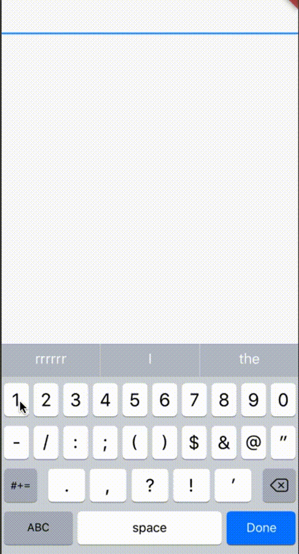

# flutter_masked_text

Masked text input for flutter.


## Install

On your dependencies, add:

```yaml
dependencies:
  flutter:
    sdk: flutter
  flutter_masked_text: ^0.1.0 #here
```

In terminal, run:
```
flutter packages get
```

## Usage
Import the library
```dart
import 'package:flutter_masked_text/flutter_masked_text.dart';
```

Create your mask controller:
```dart
var controller = new MaskedTextController(mask: '000.000.000-00');
```

Set controller to your text field:
```dart
return new MaterialApp(
    title: 'Flutter Demo',
    theme: new ThemeData(
        primarySwatch: Colors.blue,
    ),
    home: new SafeArea(
        child: new Scaffold(
            body: new Column(
                children: <Widget>[
                    new TextField(controller: controller,) // <--- here
                ],
            ),
        ),
    ),
);
```

This is the result:



## Mask Options

In mask, you can use the following characters:
* `0`: accept numbers
* `A`: accept letters
* `@`: accept numbers and letters
* `*`: accept any character

## Initial Value
To start a mask with initial value, just use `text` property on constructor:
```dart
var controller = new MaskedTextController(mask: '000-000', text: '123456');
```

## Update text programaticaly
If you want to set new text after controller initiatialization, use the `updateText` method:
```dart
var controller = new MaskedTextController(text: '', mask: '000-000');
controller.updateText('123456');

print(controller.text); //123-456
```

## Using default TextEditingController
The MaskedTextController extends TextEditingController. You can use all default native methods from this class.

